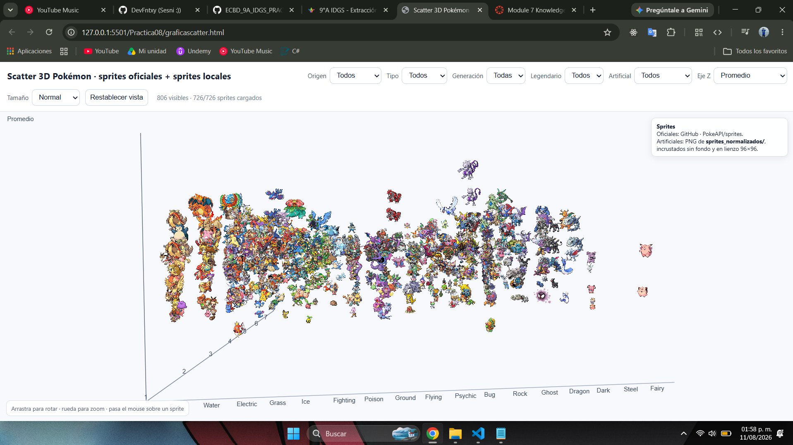
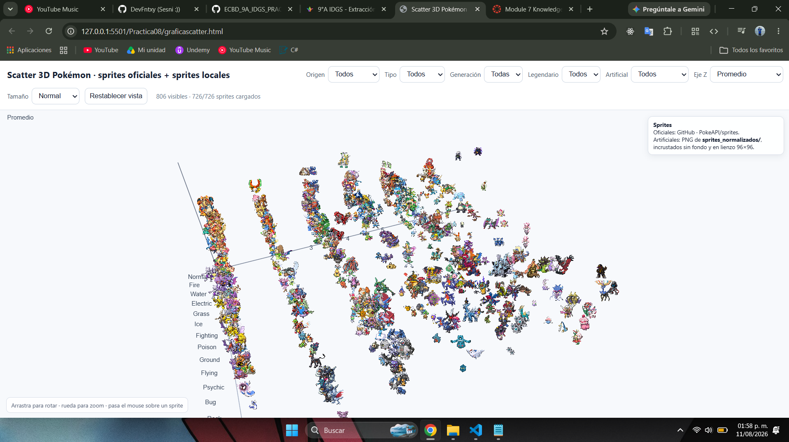
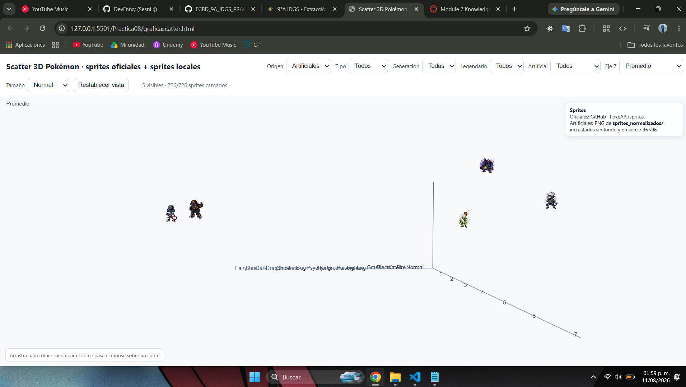
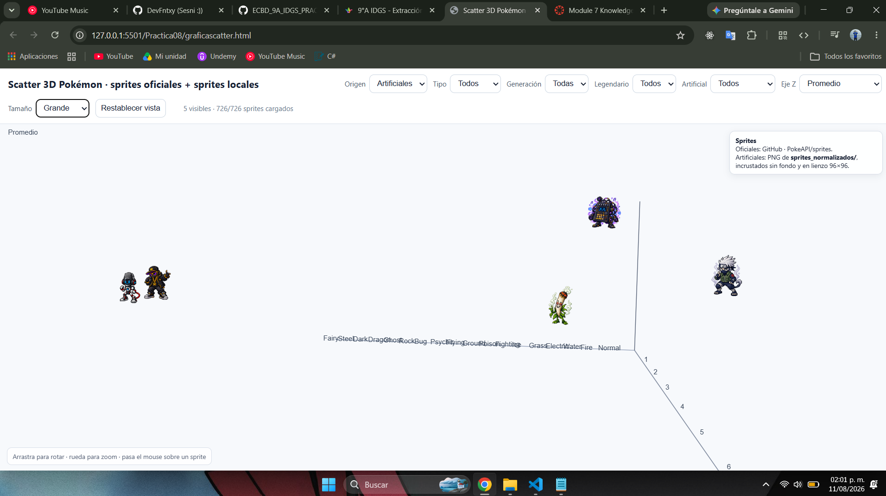
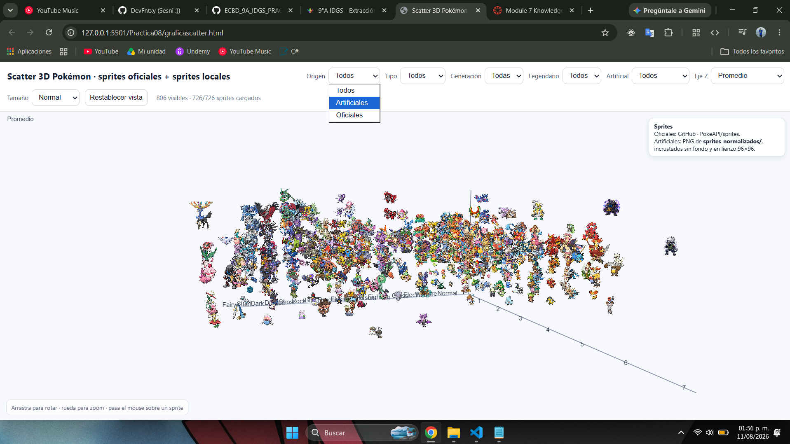
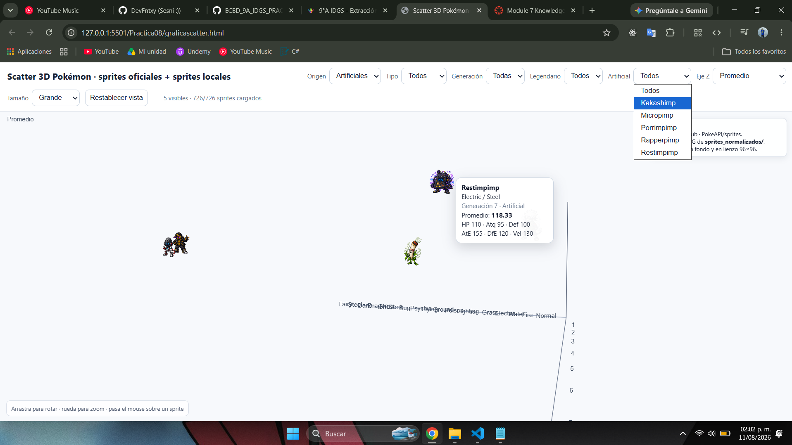

# Práctica 08: Análisis y visualización 3D de datos Pokémon

Esta práctica explora un conjunto de datos de Pokémon con estadísticas de las generaciones 1 a 6, junto con dos registros adicionales personalizados.

Objetivos principales:
- Cargar y limpiar el dataset de Pokémon.
- Normalizar columnas y categorías de tipos.
- Tratar duplicados, valores nulos y registros especiales.
- Calcular un promedio de estadísticas base para cada Pokémon.
- Realizar análisis descriptivo por generación, tipo y condición de legendario.
- Crear una visualización interactiva 3D con Plotly para comparar generación, tipo y promedio de estadísticas.
- Integrar sprites de Pokémon en la visualización y exportar el resultado a HTML.

Archivos incluidos:
- `Practica08.ipynb`: notebook con el análisis y la generación de la visualización.
- `pokemon_limpio_artificial.csv`: dataset limpio utilizado para la visualización final.
- `graficascatter.html`: visualización interactiva generada.
- `practica07_scatter3d_pokemon.html`: versión exportada de la visualización.
- `sprites/` y `sprites_normalizados/`: carpetas con imágenes de los sprites de Pokémon.

Descripción general:
La práctica combina técnicas de limpieza de datos, ingeniería de características y visualización avanzada para presentar un análisis de los atributos base de los Pokémon. Además de los filtros y estadísticas tradicionales, se incorpora una visualización 3D interactiva con detalles emergentes y sprites para mejorar la exploración de patrones por generación y tipo.

## Capturas de pantalla

- 
- 
- 
- 
- 
- 

